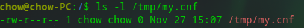

# auto-mycnf(MySQL Configure Custom)

An automation program for create my.cnf configure file for MySQL by Golang


## Usage
``` bash
user@host:~/$ go run main.go
```

Avaliable URL will list as folow

```bash
http://localhost:8080/mycnf/param/get 
```

User Interface  will be shown


* The value of the checkbox decide if it works in your configure
* The value in the text input box indicate the value respond to the key  above 

After all the configuration parameters are modified. You can click the button follow. And the file will be generated in the specified directory.


result shown as follow



